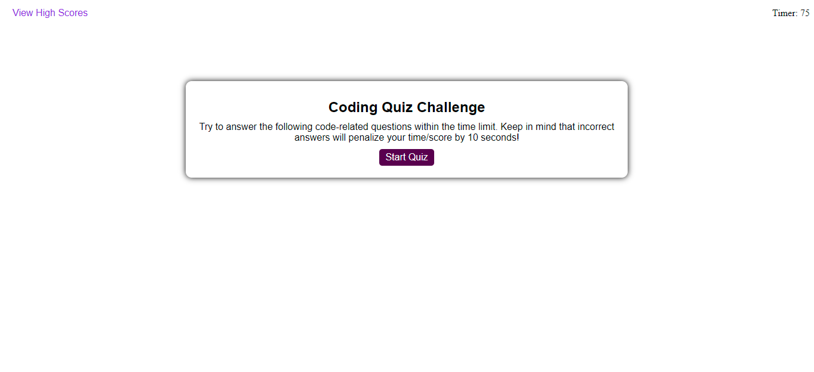
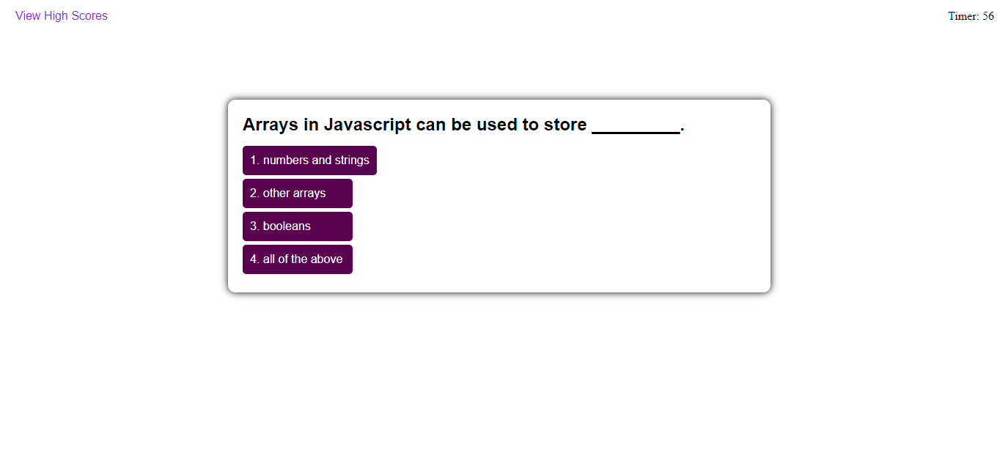
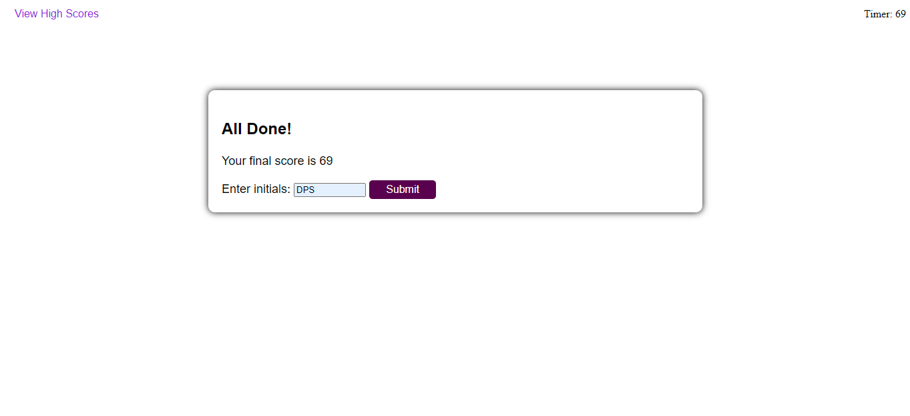
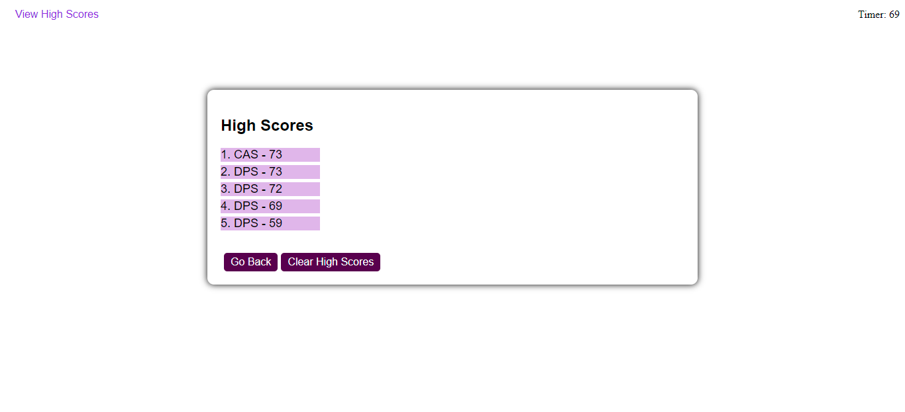

# Coding Quiz
Coding Quiz is a dynamic quiz application made with JavaScript and styled with custom CSS.

## Taking the quiz
* Clicking the "Start Quiz" button initializes an array of questions to appear one at a time and starts a countdown on the timer in the top right corner of the window.

* When an answer is selected, a dynamically generated div will appear with either "Correct!" or "Wrong!" displayed in it as appropriate for 1/2 of a second, and then the next question will be dynamically generated.
* The quiz is over when all questions have been answered, or time runs out.

## Scoring
* Your score is equal to the time left on the timer upon completion of the quiz.
* If the wrong option is selected for a question, 10 seconds will be deducted from the timer.
* If time runs out, your score is 0 and the quiz will end.

## Viewing high scores
* After the quiz ends, you have the opportunity to save your score. Your score will be displayed with a form input to submit your initials. Your initials and score are then saved as an object in localStorage.

* When you submit your score, you are taken to the high score page which displays the scores that are saved in localStorage, in order from highest to lowest, with the highest being on top.
    * Note: There is a limit of 5 scores saved in localStorage. Any score that is lower than the top 5 will be deleted.
* You can clear localStorage by clicking the button labeled "Clear High Scores", and you can go back to the main page of the coding quiz by clicking the button labeled "Go Back".
* The high scores page can be accessed at any time by clicking the button on the top left corner of the window labeled "View High Scores".
    * Note: If you click "View High Scores" in the middle of the quiz, your progress in the quiz will be lost.

